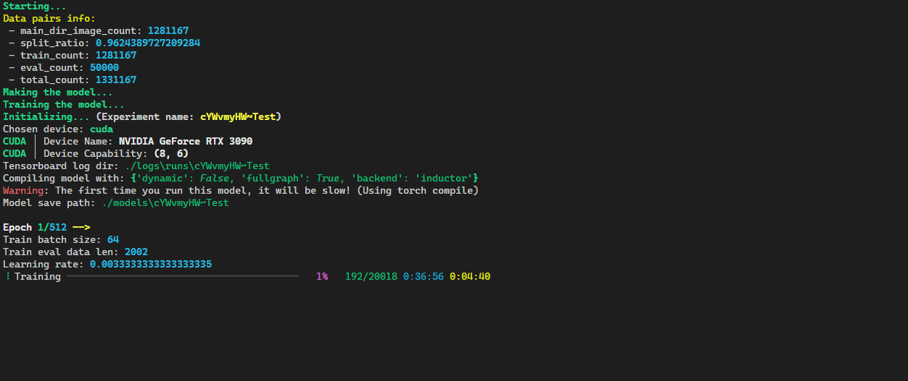

# Pytorch Image Classification Trainer (V2)

 

[](https://opensource.org/licenses/MIT)
[](https://github.com/astral-sh/ruff)

This repository provides a robust and flexible framework for training image classification models using PyTorch. It's designed to be highly customizable and easy to use, allowing you to run experiments with different models, data augmentation techniques, and training configurations.

## 📂 Project Structure

``` text
├── dataset
│   └── README.md
├── training_eng
│   ├── core
│   │   ├── device.py
│   │   ├── misc.py
│   │   └── callback_arg.py
│   ├── train_utils
│   │   ├── early_stopping.py
│   │   └── model_eval.py
│   ├── data_utils
│   │   ├── data_proc.py
│   │   └── data_loader.py
│   └── trainer.py
├── train_exper.py
├── tensorboard.cmd
├── logs
├── cache
├── uv.lock
├── pyproject.toml
├── tensorboard.sh
├── run_expers.py
├── GIT_COMMIT.md
├── models
└── expers.toml
```

## 🌶️ Features

- **Experiment Management:** Easily define and run multiple experiments using a simple TOML configuration file (`expers.toml`).
- **Data Loading and Processing:** Efficient data loading and augmentation pipelines with support for various backends (`opencv`, `pil`, `turbojpeg`).
- **Flexible Training Loop:** The core training loop in `training_eng/trainer.py` supports:
  - Mixed precision training
  - Gradient accumulation
  - Learning rate schedulers
  - Early stopping
  - TensorBoard logging
  - Model compilation with `torch.compile`
- **Extensible Model Support:** Easily integrate any PyTorch model. The current example uses `efficientnet-pytorch`.
- **Rich Console Output:** Uses the `rich` library for beautiful and informative console output.

## 🚀 Getting Started

### Prerequisites

- Python 3.11+
- PyTorch
- Other dependencies listed in `pyproject.toml`

### Installation

1. **Clone the repository:**

    ```bash
    git clone https://github.com/AidinHamedi/Pytorch-Img-Classification-Trainer-V2.git
    cd Pytorch-Img-Classification-Trainer-V2
    ```

2. **Install dependencies:**
    This project uses `uv` for package management.

    ```bash
    pip install uv
    uv sync
    ```

    If you want to use turbojpeg

    ```bash
    uv sync --extra tjpeg
    ```

### Dataset Setup

Place your training and validation datasets in the `dataset/train` and `dataset/validation` directories, respectively. The data should be organized in subdirectories, where each subdirectory represents a class.

``` text
dataset/
├── train/
│   ├── class_a/
│   │   ├── image1.jpg
│   │   └── image2.jpg
│   └── class_b/
│       ├── image3.jpg
│       └── image4.jpg
└── validation/
    ├── class_a/
    │   ├── image5.jpg
    │   └── image6.jpg
    └── class_b/
        ├── image7.jpg
        └── image8.jpg
```

## 🤔 How to Run Experiments

1. **Define your experiments in `expers.toml`:**

    Each section in `expers.toml` represents a separate experiment. You can specify the model name and other parameters for each experiment.

    **Example `expers.toml`:**

    ```toml
    ["Test"]
    model_name = "efficientnet-b0"

    ["Experiment_2"]
    model_name = "efficientnet-b1"
    ```

2. **Configure training parameters in `train_exper.py`:**

    This file contains the main configuration for the training process, including:

    - Dataset paths
    - Image resolution
    - Batch size
    - Data augmentation settings
    - Optimizer and loss function
    - And other training-related hyperparameters.

3. **Run the experiments:**

    Execute the `run_expers.py` script to start training all the experiments defined in `expers.toml`.

    ```bash
    python run_expers.py
    ```

    The script will iterate through each experiment, train the model, and save the results.

## 🎛️ Monitoring and Results

- **TensorBoard:** Monitor the training process in real-time using TensorBoard.
  - On Windows, run `tensorboard.cmd`.
  - On Linux/macOS, run `tensorboard.sh`.
- **Saved Models:** The best and latest models for each experiment are saved in the `models` directory.
- **Logs:** Training logs are stored in the `logs` directory.

## 🧪 How it Works

1. **`run_expers.py`:** This is the main entry point. It reads the `expers.toml` file and iterates through each experiment defined in it.
2. **`train_exper.py`:** For each experiment, this script sets up the data loaders, model, optimizer, and loss function based on the configuration. It then calls the `fit` function from `training_eng/trainer.py`.
3. **`training_eng/trainer.py`:** This file contains the core `fit` function that implements the training loop. It handles all the complexities of training, including mixed precision, gradient accumulation, early stopping, and logging.
4. **`training_eng/data_utils`:** These modules handle the creation of data pairs, data loading, and data augmentation.
5. **`training_eng/train_utils`:** These modules provide utilities for model evaluation and early stopping.
6. **`training_eng/core`:** These modules provide core functionalities like device management and callback arguments.

## 📷 Example Output




## 🤝 Contributing

Contributions are welcome! Please feel free to submit a pull request or open an issue.

## 📝 License

<pre>
 Copyright (c) 2025 Aidin Hamedi

 This software is released under the MIT License.
 https://opensource.org/licenses/MIT
</pre>
